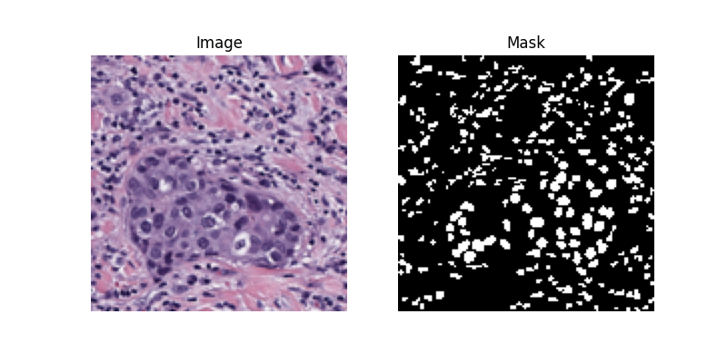

Experimental U-Net CNN for segmentation of cells, based on [P3_Cats_And_Dogs](https://github.com/NightlyTwo58/P3_Cats_And_Dogs).
Currently using [MoNuSeg Cancer Tumor Dataset](https://monuseg.grand-challenge.org/Data/). The .xml files with nuclear boundary annotations originally interpreted by MATLAB code attached but now integrated as Python code.

